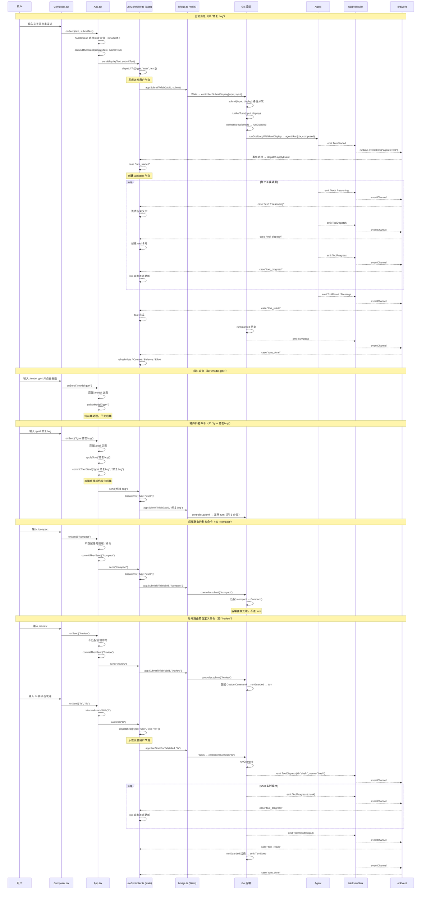

# 用户发送消息全生命周期流程图

<!--
版本: v1.0
创建: 2026-06-14 07:44:31
更新: 2026-06-14 07:44:31
-->

> 追踪用户在 Desktop 前端输入文字、点击发送按钮后，消息从前端渲染到后端处理再回到前端的完整链路。

---

## 一、全景图

```
┌─────────────────────────────────────────────────────────────────────┐
│  前端 (TypeScript / React)                                          │
│  Composer.tsx → App.tsx → useController.ts → bridge.ts              │
│       │                                                             │
│       │ Wails binding (app.SubmitToTab / app.RunShellForTab)        │
│       ▼                                                             │
│  后端 (Go)                                                          │
│  app.go → controller.go → agent.go → event sink → Wails EventsEmit  │
│       │                                                             │
│       │ Wails eventChannel ("agent:event")                          │
│       ▼                                                             │
│  前端事件流                                                         │
│  bridge.ts onEvent → useController.ts applyEvent → reducer → render │
└─────────────────────────────────────────────────────────────────────┘
```

---

## 二、Mermaid 时序图



## 三、分步流程图

### Step 1: 用户在输入框输入文字

| 文件 | 行号 | 逻辑 |
|------|:----:|------|
| `Composer.tsx` | 1933 | input 区显示 placeholder / 用户输入 |
| `Composer.tsx` | 1417 | Enter 发送（Shift+Enter 换行）|
| `Composer.tsx` | 2000+ | 点击发送按钮执行 `onSend(displayText, submitText)` |

### Step 2: Composer 调用 onSend

```
Composer.onSend(text)                    ← Composer.tsx:858
  → App.tsx handleSend(text, submitText) ← App.tsx:1436
```

### Step 3: handleSend 分流

```
handleSend(trimmed, submitText)
  │
  ├─ ! → runShell(cmd)                           ← App.tsx:1440
  │   └─ 前端拦截 → dispatchTo("user") + app.RunShellForTab
  │
  ├─ /model → switchModel(model[1])               ← App.tsx:1449
  │   └─ 纯前端处理，不走后端
  │
  ├─ /memory → closeTransientOverlays + 打开设置  ← App.tsx:1454
  │   └─ 纯前端处理
  │
  ├─ /clear → setClearContextPending(true)        ← App.tsx:1459
  │   └─ 纯前端确认弹窗 → 确认后调 confirmClearContext
  │
  ├─ /goal → applyGoal(arg) + commitThenSend     ← App.tsx:1463
  │   └─ 前端 applyGoal + 仍发往后端 submit() 路由
  │
  ├─ /theme → 主题切换                            ← App.tsx:1479
  │   └─ 纯前端处理
  │
  ├─ running → steer(submitText.trim())           ← App.tsx:1505
  │   └─ 正在运行中 → 作为 steer 发送
  │
  └─ 正常消息 → commitThenSend(trimmed, submitText) ← App.tsx:1509
      │
      ├─ dispatchTo({ type: "user" }) ← 乐观派发
      └─ app.SubmitToTab / SubmitDisplayToTab
          → Go submit() 第二层路由:
              ├─ // → runRefTurn (代码注释)
              ├─ /compact → Compact (后台压缩)
              ├─ /new → NewSession
              ├─ /clear → ClearSession
              ├─ /tree → BranchTreeText
              ├─ /branch / /switch → 分支管理
              ├─ /rewind → Rewind
              ├─ /model / /memory / /skills / /hooks / /mcp → 管理通知
              ├─ /mcp__ → MCP prompt
              ├─ CustomCommand → runGuarded → turn
              ├─ RunSkill → runGuarded → turn
              └─ default → runRefTurn → turn
```

### 分支 A: Shell 命令（!ls）

```
App.tsx runShell(cmd)                    ← App.tsx:1440-1447
  → useController.ts runShell(cmd)       ← useController.ts:799-803
      │
      ├─ dispatchTo(tabId, { type: "user", text: "!ls" })
      │   └─ reducer case "user": ← useController.ts:459-468
      │       items.push({ kind: "user", id, text: "!ls" })
      │       → 用户气泡立即出现在对话列表中（乐观派发）
      │
      └─ app.RunShellForTab(tabId, "ls")
          → Wails → Go desktop/app.go RunShellForTab
              → controller.RunShell("ls")
                  → runGuarded(body) ← controller.go:990-1052
                      ├─ emit ToolDispatch(id="shell-...", name="bash")
                      ├─ exec.Command("ls")  → 执行 shell
                      ├─ emit ToolProgress(chunk)   ← 实时 stdout
                      ├─ emit ToolResult(output)     ← 最终结果
                      ├─ emit TurnDone                ← runGuarded 结束
                      └─ c.running = false
```

### 分支 B: 正常消息（"修复 bug"）

```
commitThenSend(displayText, submitText)  ← App.tsx:1998-2018
  │
  ├─ 检查 rewind 状态（若有回退先执行）  ← App.tsx:1999-2016
  │
  └─ send(displayText, submitText)       ← useController.ts:777-797
      │
      ├─ dispatchTo(tabId, { type: "user", text, seq })
      │   └─ reducer case "user": ← useController.ts:459-468
      │       items.push({ kind: "user", id, text: "修复 bug" })
      │       → 用户气泡立即出现（乐观派发）
      │       running = true, pendingUser = "修复 bug"
      │
      └─ app.SubmitToTab(tabId, submitText)
          → Wails → Go desktop/app.go SubmitToTab
              → controller.SubmitDisplay(input, input)
                  → controller.submit(input, display)
```

### Step 4: 后端 submit 路由（第二层）

```
controller.submit(input, display)        ← controller.go:773-909
  │
  ├─ #note → MemoryQuickAddNote         ← 记忆笔记（# 开头）
  ├─ /remember → RememberCommandNote     ← 记忆命令
  ├─ /goal → applyGoalCommand            ← Goal 命令
  ├─ ! → RunShell                        ← Shell（前端已拦截，后端兜底）
  ├─ // → runRefTurn                     ← 代码注释 / file:// URL
  │
  ├─ /compact → Compact                  ← 上下文压缩
  ├─ /new → NewSession                   ← 新会话
  ├─ /clear → ClearSession               ← 清除上下文
  ├─ /tree → BranchTreeText (notice)     ← 分支树
  ├─ /branch → ForkNamed / Branch        ← 分支操作
  ├─ /switch → SwitchBranch              ← 切换分支
  ├─ /rewind → Rewind                    ← 检查点回退
  ├─ /mcp__ → MCP prompt                 ← MCP 命令
  ├─ /model → notice (管理命令列表)       ← 模型管理
  ├─ /memory → notice                    ← 记忆管理
  ├─ /skills → notice                    ← Skill 管理
  ├─ /hooks → notice                     ← Hook 管理
  ├─ /mcp → notice                       ← MCP 管理
  │
  ├─ CustomCommand → runGuarded → turn   ← 自定义命令（/review 等）
  ├─ RunSkill → runGuarded → turn        ← Skill 调用（/skill-name）
  │
  └─ default: runRefTurn(input, display)  ← controller.go:907
      → runRefTurnWithRefs(input, input, display)
          → runGuarded(body)
              ├─ ResolveRefs(ctx, input)     ← 解析 @引用
              ├─ build composed prompt       ← 拼接引用上下文
              └─ runGoalLoopWithRawDisplay   ← 执行 turn
```

> 前端 `handleSend` 是第一层路由（拦截 `/model`、`/memory`、`/clear`、`/goal`、`/theme`、`!`）。  
> 后端 `submit()` 是第二层路由（拦截所有未在前端匹配的 `/` 命令，以及兜底的 `!`、`#` 等）。  
> 两层都不匹配的消息走 `default: runRefTurn` → 正常 turn。

### Step 5: runGuarded 核心

```
runGuarded(body)                          ← controller.go:428-465
  │
  ├─ mu.Lock(); if running → return       ← 并发保护
  ├─ ctx, cancel = context.WithCancel(...)
  ├─ c.running = true                     ← 标记运行中
  ├─ c.cancel = cancel                    ← 供取消用
  ├─ go autosaveWhileRunning(ctx)         ← 自动保存
  │
  ├─ go body(ctx)                         ← 执行 turn
  │   ├─ success → emit TurnDone(nil)
  │   ├─ error   → emit TurnDone(err)
  │   └─ panic   → recover → emit TurnDone("internal error")
  │
  ├─ c.running = false                    ← 清除运行标记
  └─ c.cancel = nil
```

### Step 6: runTurnWithRawDisplay — 单轮执行

```
runTurnWithRawDisplay(ctx, input, raw, display)  ← controller.go:545-600
  │
  ├─ maybeSessionStart(ctx)              ← 会话初始化
  ├─ maybeAutoPlan(ctx, raw)             ← 自动 plan 检测
  ├─ input = Compose(input)              ← 注入块处理器
  │   ├─ <active-goal>（goal 模式时）
  │   ├─ PlanModeMarker（plan 模式时）
  │   ├─ <reasoning-language>
  │   ├─ <memory-update>
  │   └─ <background-jobs>
  │
  ├─ recordDisplayForNewUser(display)    ← 记录 display 映射
  ├─ beginCheckpoint(input)              ← 检查点
  ├─ hooks.PromptSubmit(ctx, input)      ← Hook 前处理
  │
  ├─ agent.Run(ctx, composed)            ← ★ Agent 核心循环
  │   ├─ emit TurnStarted                ← 通知前端 turn 开始
  │   ├─ session.Add(user message)       ← 写入历史
  │   └─ tool loop:
  │       ├─ LLM call → emit Text/Reasoning
  │       ├─ tool dispatch → emit ToolDispatch
  │       ├─ tool execute → emit ToolProgress
  │       └─ tool result → emit ToolResult
  │
  ├─ plan approval（plan 模式时审批）    ← controller.go:575-600
  └─ return
```

### Step 7: 事件回到前端

```
Go desktop/tabs.go tabEventSink.Emit(e)  ← tabs.go:228-230
  → runtime.EventsEmit(ctx, "agent:event", toWireTab(e))
      │
      ▼ Wails 事件通道
      │
  bridge.ts onEvent(cb)                   ← bridge.ts:346
    → useController.ts useEffect          ← useController.ts:692-724
        │
        ├─ turn_started → reducer → 创建 assistant 气泡 ← line 336
        ├─ text/reasoning → reducer → 流式渲染文字  ← line 346
        ├─ message → reducer → 完成 assistant 消息  ← line 354
        ├─ tool_dispatch → reducer → 创建 tool 卡片  ← line 363
        ├─ tool_progress → reducer → tool 输出流式更新 ← line 398
        ├─ tool_result → reducer → tool 完成  ← line 381
        ├─ turn_done → reducer
        │   ├─ refreshMeta (model/branch)
        │   ├─ refreshContext (token 用量)
        │   ├─ refreshBalance
        │   ├─ refreshEffort
        │   ├─ refreshCheckpoints
        │   └─ refreshJobs
        └─ notice → reducer → notice 栏 ← line 514
```

### Step 8: 前端渲染

```
React 组件树
  │
  ├─ App.tsx 从 useController 读取 state.items  ← 通过 tabStatesRef
  │
  ├─ Conversation.tsx (或类似组件)
  │   └─ 遍历 items:
  │       ├─ kind: "user"      → 用户消息气泡
  │       ├─ kind: "assistant" → AI 回复气泡
  │       ├─ kind: "tool"      → 工具调用卡片
  │       ├─ kind: "notice"    → 通知栏
  │       └─ kind: "compaction"→ 上下文压缩提示
  │
  └─ React 虚拟 DOM diff → 浏览器渲染
```

---

## 三、关键数据结构

### 前端 State（每 tab 一个）

```typescript
// useController.ts State
interface State {
  items: ConversationItem[];    // ← 对话列表
  pendingUser?: string;         // ← 待 flush 的用户消息
  running: boolean;             // ← 是否正在处理
  seq: number;                  // ← 消息序号
  currentAssistant?: string;    // ← 当前 streaming 的 assistant id
  live?: { id: string; text: string; reasoning: string }; // ← 实时流
}
```

### ConversationItem 类型

```typescript
type ConversationItem =
  | { kind: "user"; id: string; text: string }
  | { kind: "assistant"; id: string; text: string; reasoning: string; streaming: boolean }
  | { kind: "tool"; id: string; name: string; args: string; status: "running"|"done"|"error"; output: string }
  | { kind: "notice"; id: string; text: string; level: "info"|"warn" }
  | { kind: "compaction"; id: string; pending: boolean; ... };
```

### 后端事件（经 Wails → Frontend）

```typescript
// WireEvent (事件通道中传递)
type WireEvent = {
  kind: "turn_started" | "text" | "reasoning" | "message"
      | "tool_dispatch" | "tool_progress" | "tool_result"
      | "turn_done" | "notice" | "usage" | ...;
  tabId?: string;
  text?: string;
  reasoning?: string;
  tool?: { id: string; name: string; args: string; output: string; ... };
  // ...
};
```

---

## 四、关键文件索引

| 步骤 | 文件 | 行号 | 功能 |
|:----:|------|:----:|------|
| 1 | `Composer.tsx` | 858 | `onSend` 调用 |
| 1 | `Composer.tsx` | 1417 | Enter 发送逻辑 |
| 2, 3 | `App.tsx` | 1436 | `handleSend` 主路由 |
| 3 | `App.tsx` | 1440 | `!` shell 命令拦截 |
| 3 | `App.tsx` | 1449 | `/model` 前端拦截 |
| 3 | `App.tsx` | 1454 | `/memory` 前端拦截 |
| 3 | `App.tsx` | 1459 | `/clear` 前端拦截 |
| 3 | `App.tsx` | 1463 | `/goal` 前端拦截+后端转发 |
| 3 | `App.tsx` | 1479 | `/theme` 前端拦截 |
| 3A | `useController.ts` | 799 | `runShell` 回调 |
| 3B | `App.tsx` | 1998 | `commitThenSend` 回调 |
| 3B | `useController.ts` | 777 | `send` 回调 |
| 3B | `useController.ts` | 780 | 乐观派发 `dispatchTo({ type: "user" })` |
| 3B | `useController.ts` | 459 | reducer `case "user"` |
| 4 | `controller.go` | 773 | `submit()` 路由 |
| 4 | `controller.go` | 907 | `runRefTurn` 默认路径 |
| 4 | `controller.go` | 1064 | `runRefTurnWithRefs` |
| 5 | `controller.go` | 428 | `runGuarded` |
| 6 | `controller.go` | 545 | `runTurnWithRawDisplay` |
| 6 | `input.go` | 82 | `Compose()` 注入 |
| 6 | `agent.go` | 535 | `Agent.Run()` 核心循环 |
| 6 | `agent.go` | 544 | emit `TurnStarted` |
| 7 | `tabs.go` | 228 | `EventsEmit` 到前端 |
| 7 | `bridge.ts` | 346 | `onEvent` 订阅 |
| 7 | `useController.ts` | 692 | 事件处理循环 |
| 7 | `useController.ts` | 336 | reducer `case "turn_started"` |
| 7 | `useController.ts` | 346 | reducer `case "text"` |
| 7 | `useController.ts` | 363 | reducer `case "tool_dispatch"` |
| 7 | `useController.ts` | 712 | `turn_done` → refresh |
| 8 | `app.go` | 1606 | `historyMessages` 历史加载 |
| 8 | `useController.ts` | 511 | reducer `case "history"` |

---

## 五、A-Loop 与发送按钮的路径差异

| 环节 | 发送按钮 | A-Loop (`SubmitDisplay`) |
|------|:--------:|:------------------------:|
| 前端 `dispatchTo("user")` | ✅ 乐观派发气泡 | ❌ |
| 前端 `!` 拦截 | ✅ 走 `runShell` | ❌ 走后端 `submit` |
| 后端 `submit()` 路由 | ✅ | ✅ （相同） |
| `runGuarded` | ✅ | ✅ |
| `agent.Run` (正常文本) | ✅ | ✅ |
| `RunShell` (`!` 文本) | ✅ | ✅ |
| 事件流 → 前端渲染 | ✅ | ✅ |
| `turn_done` → refresh | ✅ | ✅ |
| CS 切换后历史重载 | ✅ | ✅ |
